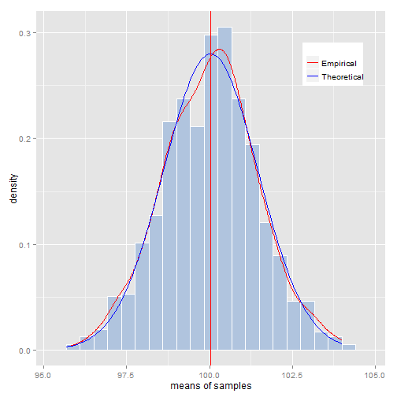

Simulates the Central Limit Theorem (CLT)
========================================================
author: Zhang, Zi Wei 
date: 2015-03-15


Short Introduction
========================================================

[This Shiny Application](https://karibu.shinyapps.io/courseraProject) is inspired by the Coursera course of **Statistical Inference** by *Brian Caffo, from Johns Hopkins University*.  

In this app, we are to investigate the difference types of distribution and compare it with the Central Limit Theorem. The population size, sample size, and number of sampling are all configurable. The demo distribution includes:
- Normal
- Binomial(fair/unfair coins)
- Poisson
- Exponential

A bit of Theory
========================================================

**[The central limit theorem (CLT)](http://en.wikipedia.org/wiki/Central_limit_theorem)** states that, given certain conditions, the arithmetic mean of a sufficiently large number of iterates of independent random variables, each with a well-defined expected value and well-defined variance, will be approximately normally distributed, regardless of the underlying distribution.

The **[standard error](http://en.wikipedia.org/wiki/Standard_error#Standard_error_of_the_mean)** of the mean (SEM) is the standard deviation of the sample-mean's estimate of a population mean. 

$\text{SE}_\bar{x}\ = \frac{s}{\sqrt{n}}$ ,  
*where*, **s** is the sample standard deviation (i.e., the sample-based estimate of the standard deviation of the population), and **n** is the size (number of observations) of the sample.

Under the Hood
========================================================
To illustrate with a population of poisson distribution of population size of 10,000, mean=100, we make 1000 samples with each sized 50 and take their mean:

```r
population <- rpois(10000, 100)
samples <- matrix(data=NA, nrow=1000, ncol=50)
for(i in 1:1000) samples[i,] <- sample(x=population, size=50, replace = FALSE)
x_bars <- apply(samples, 1, mean)
c(mean(x_bars), sd(x_bars), sd(population)/sqrt(50))
```

```
[1] 100.024020   1.422296   1.424014
```

Final Plotting:
=====================================================

 
